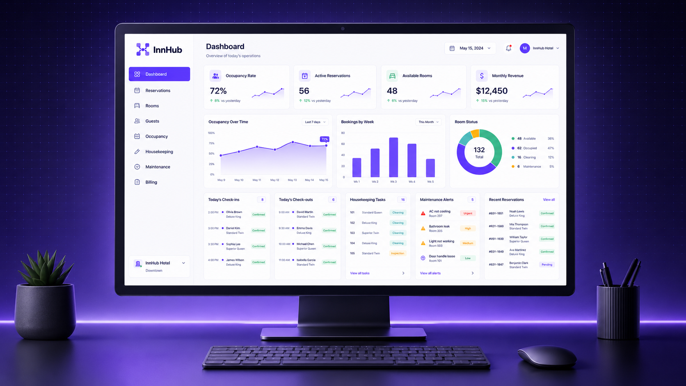
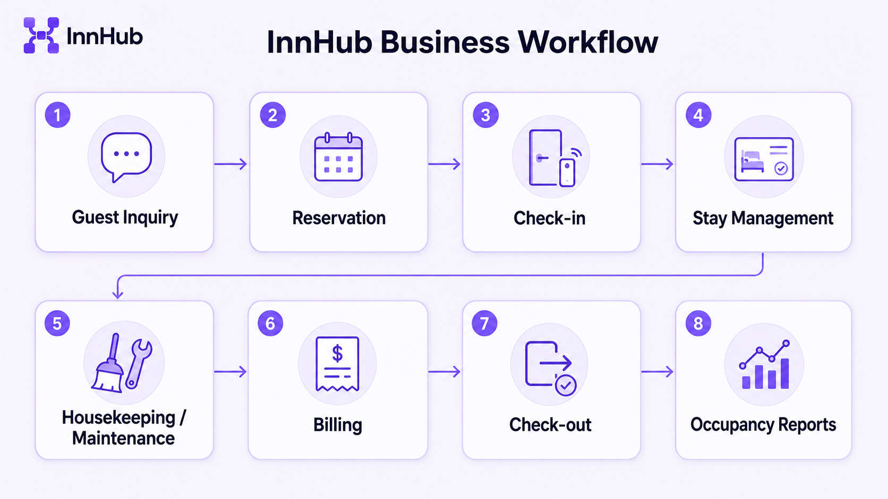
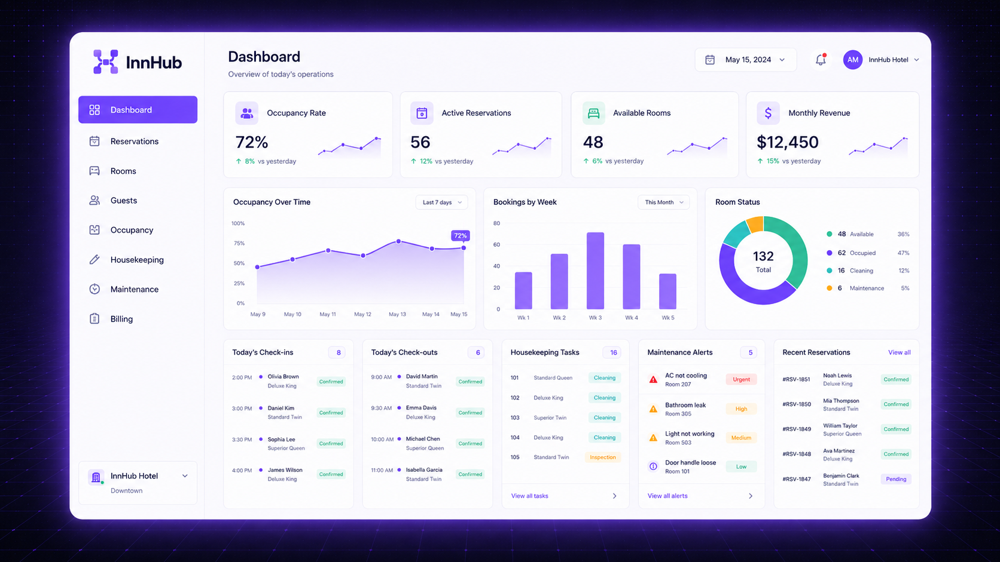
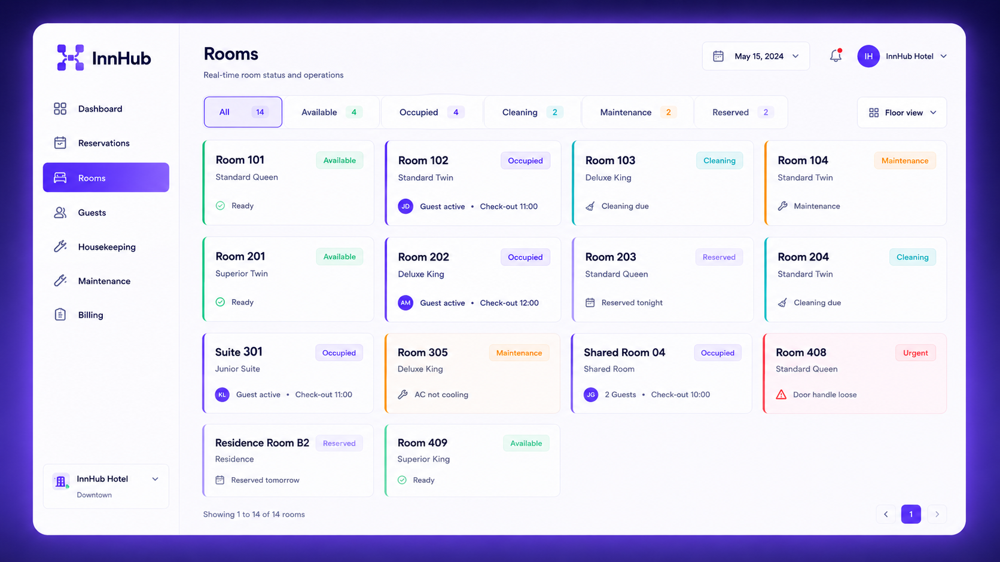
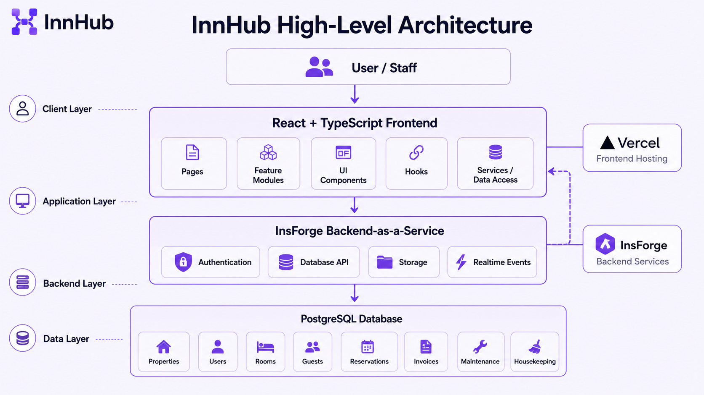

<div align="center">


# InnHub — Sistema de Gestión de Alojamientos

**Plataforma de gestión para hoteles, hostales, residenciales y negocios de alojamiento basados en habitaciones.**

<p>
  
  
  
  
  
  
  
</p>

<p>
  
  
</p>

</div>

---

> InnHub es un MVP académico/profesional enfocado en operaciones de alojamiento, arquitectura limpia y documentación presentable como caso real de producto.

---

📄 Leer en: [English](README.md) | **Español**

---

## Vista previa

<div align="center">



</div>

---

## Tabla de contenidos

- [Qué hace](#qué-hace)
- [Flujo de negocio](#flujo-de-negocio)
- [Funcionalidades clave](#funcionalidades-clave)
- [Stack](#stack)
- [Arquitectura](#arquitectura)
- [Documentación](#documentación)
- [Estado del proyecto](#estado-del-proyecto)
- [Autor](#autor)

---

## Qué hace

InnHub centraliza el flujo operativo de negocios de alojamiento: propiedades, habitaciones, huéspedes, reservas, check-in, limpieza, mantenimiento, facturación, pagos, reportes y métricas de dashboard.

Está pensado como un MVP configurable tipo COTS para negocios de alojamiento basados en habitaciones, como hoteles, hostales, residenciales, posadas y propiedades similares.

**Antes de InnHub:** las reservas, el estado de habitaciones, el mantenimiento, la limpieza y la facturación pueden quedar dispersos entre planillas, mensajes de WhatsApp, cuadernos y procesos informales.

**Después de InnHub:** el equipo puede operar desde una sola aplicación web con disponibilidad clara de habitaciones, ciclo de vida de reservas, tareas operativas, facturas e indicadores de ocupación.

## Flujo de negocio

<div align="center">



</div>

```text
Consulta del huésped → Reserva → Check-in → Gestión de estadía
      → Limpieza / Mantenimiento → Facturación → Check-out → Reportes de ocupación
```

## Funcionalidades clave

### Dashboard

- Tasa de ocupación, reservas activas, habitaciones disponibles y métricas de ingresos.
- Alertas operativas para limpieza, mantenimiento, check-ins y check-outs.
- Actualizaciones realtime selectivas para visibilidad operativa.

<div align="center">



</div>

### Reservas

- Creación, cancelación y seguimiento del ciclo de vida de reservas.
- Validación de disponibilidad por rango de fechas.
- Regla para evitar reservas activas superpuestas sobre la misma habitación.

### Habitaciones

- Gestión de habitaciones y tipos de habitación.
- Estados físicos de habitación: `available`, `occupied`, `cleaning`, `maintenance`, `inactive`.
- La disponibilidad se calcula desde las reservas; no se guarda como estado físico `reserved`.

<div align="center">



</div>

### Huéspedes

- Registros de huéspedes/clientes por propiedad.
- Datos de contacto e identificación requeridos para reservas y facturas.

### Limpieza y mantenimiento

- Tareas de limpieza generadas después del check-out.
- Tickets de mantenimiento que pueden bloquear la disponibilidad de habitaciones.
- Estados de tareas operativas para seguimiento del equipo.

### Facturación y pagos

- Generación manual de facturas para estadías completadas o servicios.
- Seguimiento manual de pagos.
- Sin pasarela de pagos externa en el MVP.

## Stack

| Categoría                 | Tecnología                  |
| ------------------------- | --------------------------- |
| Frontend                  | Vite + React + TypeScript   |
| Estilos                   | Tailwind CSS                |
| Routing                   | React Router                |
| Formularios / Validación  | React Hook Form + Zod       |
| Gráficos                  | Recharts                    |
| Testing                   | Vitest                      |
| Backend / BaaS            | InsForge                    |
| Base de datos             | PostgreSQL                  |
| Auth / Storage / Realtime | Servicios de InsForge       |
| Deploy                    | Vercel o Netlify + InsForge |

## Arquitectura

<div align="center">



</div>

InnHub sigue una arquitectura frontend pragmática que combina organización por features, límites livianos de Clean Architecture y Atomic Design solo para primitivas de UI compartida.

Regla central: los componentes de UI no deben hablar directamente con InsForge. El acceso a datos y las reglas de negocio se encapsulan en services, hooks, schemas y funciones puras.

## Documentación

| Documento                                                          | Propósito                                        |
| ------------------------------------------------------------------ | ------------------------------------------------ |
| [Visión del producto](docs/01-product-overview.es.md)              | Idea de producto, problema, usuarios y objetivos |
| [Alcance MVP](docs/02-mvp-scope.es.md)                             | Módulos incluidos, límites y criterios de éxito  |
| [Modelo de dominio](docs/03-domain-model.es.md)                    | Entidades, relaciones y reglas de negocio        |
| [Stack tecnológico](docs/04-tech-stack.es.md)                      | Tecnologías, razones y trade-offs                |
| [Arquitectura](docs/05-architecture.es.md)                         | Estructura interna, límites y flujo de datos     |
| [Flujo Git](docs/06-git-workflow.es.md)                            | Ramas, issues, PRs y reglas de entrega           |
| [Especificación funcional](docs/07-functional-specification.es.md) | Actores, requisitos, reglas y aceptación         |

## Estado del proyecto

InnHub está en fase de planificación y documentación. El siguiente paso de implementación es inicializar la aplicación web y empezar a construir los módulos del MVP en unidades pequeñas y revisables.

## Autor

**Diego Vargas** — Full-Stack Developer

- GitHub: [@temps-code](https://github.com/temps-code)
