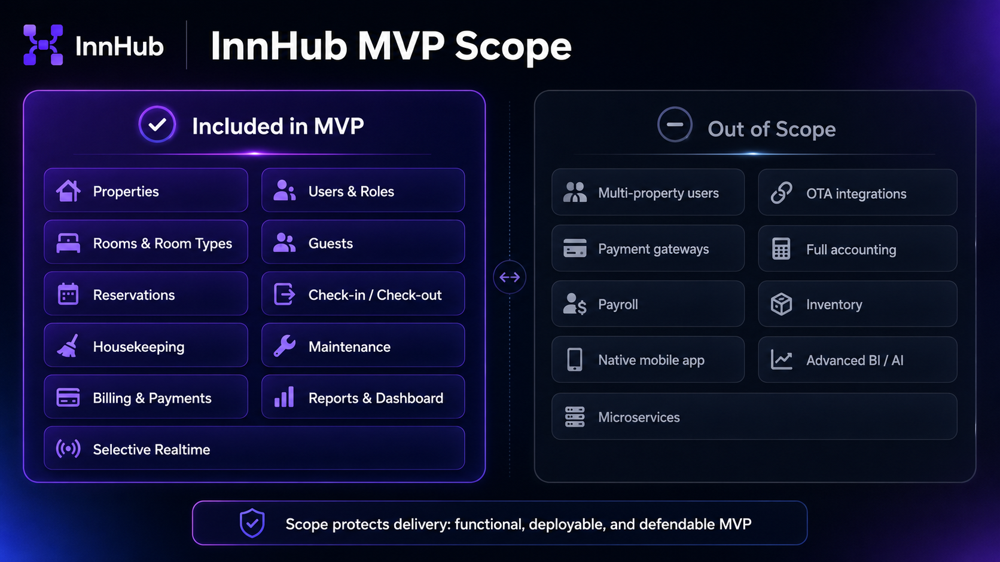

# InnHub — MVP Scope

> This document defines what the MVP includes, what it intentionally excludes, and which decisions protect delivery scope.

📄 Read this in: **English** | [Español](02-mvp-scope.es.md)

---

## MVP Goal

Build a functional accommodation-management MVP that can support the core operation of one or more registered properties while keeping each user tied to a single property context.

## Scope Summary



The MVP scope is intentionally limited to the modules needed for a functional, deployable, and defendable accommodation-management product.

| Module               | Included in MVP | Notes                                                   |
| -------------------- | --------------: | ------------------------------------------------------- |
| Properties           |             Yes | Operational root for settings and data isolation        |
| Users / Roles        |             Yes | Admin, manager, receptionist, housekeeping, maintenance |
| Rooms / Room Types   |             Yes | Physical room inventory and pricing/configuration basis |
| Guests / Customers   |             Yes | Records belong to a property                            |
| Reservations         |             Yes | Date-range booking and availability validation          |
| Check-in / Check-out |             Yes | Operational lifecycle actions                           |
| Housekeeping         |             Yes | Cleaning tasks, especially after check-out              |
| Maintenance          |             Yes | Tickets that can block rooms                            |
| Billing / Payments   |             Yes | Manual invoices and manual payment tracking             |
| Reports / Dashboard  |             Yes | Occupancy, revenue, alerts, operational summary         |
| Selective Realtime   |             Yes | Scoped by property and only where useful                |

## Key Scope Decisions

| Area                   | Decision                                                                         |
| ---------------------- | -------------------------------------------------------------------------------- |
| Property context       | Every operational record belongs to one property                                 |
| User assignment        | Each user belongs to exactly one property in the MVP                             |
| Customer records       | Guests/customers are scoped to one property                                      |
| Room reservation state | No physical `reserved` room status; availability is calculated from reservations |
| Payments               | Manual payment tracking only, no gateway                                         |
| Reports                | Can be calculated on demand, not necessarily persisted                           |
| Realtime               | Opt-in and property-scoped, not global by default                                |

## Room States

Physical room states:

```text
available → occupied → cleaning → available
available → maintenance → available
available → inactive
```

A room being booked for future dates is handled by the reservation calendar, not by changing the physical room state to `reserved`.

## Out of Scope

- Advanced SaaS billing or organization hierarchy.
- Users operating across multiple properties.
- External OTA integrations.
- Real payment gateways.
- Full accounting, payroll, and inventory.
- Native mobile app.
- Complex CRM, BI, AI, or microservices.

## Success Criteria

- A user can configure a property and rooms.
- A receptionist can create a guest, reservation, check-in, check-out, invoice, and payment.
- Cleaning and maintenance workflows affect room availability.
- Reports/dashboard provide useful operational visibility.
- The system is deployable and defendable as a professional MVP.

## Related Documents

- [Product Overview](01-product-overview.md)
- [Domain Model](03-domain-model.md)
- [Functional Specification](07-functional-specification.md)
