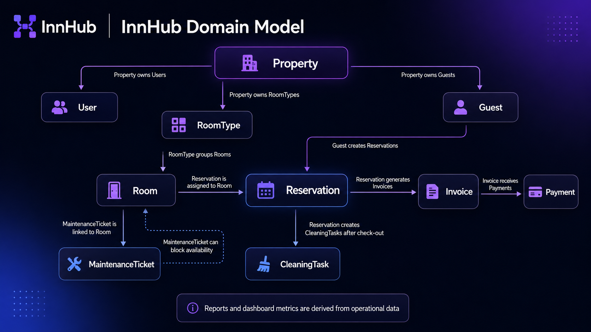

# InnHub — Modelo de Dominio

> Este documento define las entidades principales, relaciones y reglas de negocio del MVP.

📄 Leer en: [English](03-domain-model.md) | **Español**

---

## Resumen ejecutivo

InnHub se organiza alrededor de una entidad raíz `Property`. Todo registro operativo pertenece a una propiedad para simplificar permisos, reportes, reservas y visibilidad de datos en el MVP.

## Diagrama de modelo de dominio



El diagrama muestra `Property` como raíz operativa. Las reservas conectan huéspedes, habitaciones, facturas, pagos, tareas de limpieza y decisiones de mantenimiento relacionadas con disponibilidad.

## Entidades principales

| Entidad             | Propósito                                                    |
| ------------------- | ------------------------------------------------------------ |
| `Property`          | Configuración del alojamiento y raíz operativa               |
| `User`              | Personal autenticado asignado a una propiedad                |
| `RoomType`          | Categoría/configuración de habitaciones similares            |
| `Room`              | Habitación/unidad física gestionada por la propiedad         |
| `Guest`             | Persona o cliente asociado a reservas/facturas               |
| `Reservation`       | Reserva por rango de fechas para un huésped y una habitación |
| `CleaningTask`      | Tarea de limpieza, usualmente luego del check-out            |
| `MaintenanceTicket` | Incidencia operativa que puede bloquear habitaciones         |
| `Invoice`           | Documento de facturación para una reserva/estadía            |
| `Payment`           | Registro manual de pago vinculado a una factura              |

## Relaciones

```text
Property
├── Users
├── RoomTypes ─── Rooms
├── Guests ────── Reservations ─── Invoices ─── Payments
│                    │
│                    └── CleaningTasks
└── MaintenanceTickets ─── Rooms
```

## Modelos derivados

Pueden calcularse bajo demanda:

- `OccupancyReport`
- `RevenueReport`
- `DashboardSummary`
- `OperationalAlert`

## Reglas de negocio

| Regla                                | Explicación                                                          |
| ------------------------------------ | -------------------------------------------------------------------- |
| Sin reservas activas superpuestas    | Una habitación no puede tener dos reservas activas en el mismo rango |
| Check-out genera limpieza            | Luego del check-out, la habitación entra al flujo de limpieza        |
| Mantenimiento bloquea disponibilidad | Habitaciones en mantenimiento no deben asignarse                     |
| Facturas pagadas se protegen         | No se modifican libremente                                           |
| Reportes derivados                   | Resumen de datos operativos; no requieren persistencia inicial       |

## Decisión de nombres

Se usa `Property` como raíz amplia porque InnHub no es solo para hoteles. Se mantiene `Room` en el MVP porque el producto sigue siendo basado en habitaciones y conviene mantenerlo simple.

## Documentos relacionados

- [Alcance MVP](02-mvp-scope.es.md)
- [Especificación funcional](07-functional-specification.es.md)
- [Arquitectura](05-architecture.es.md)
