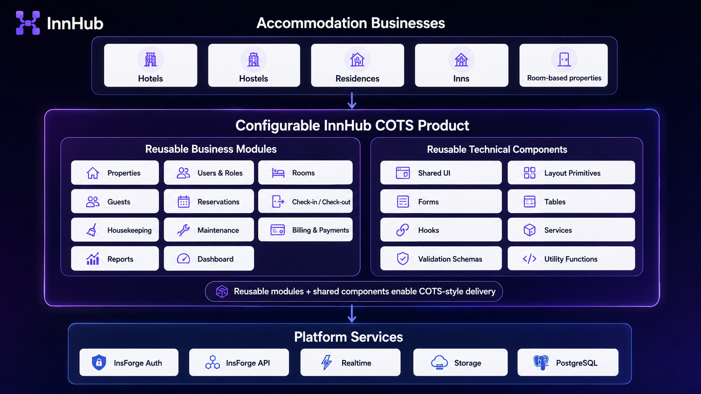
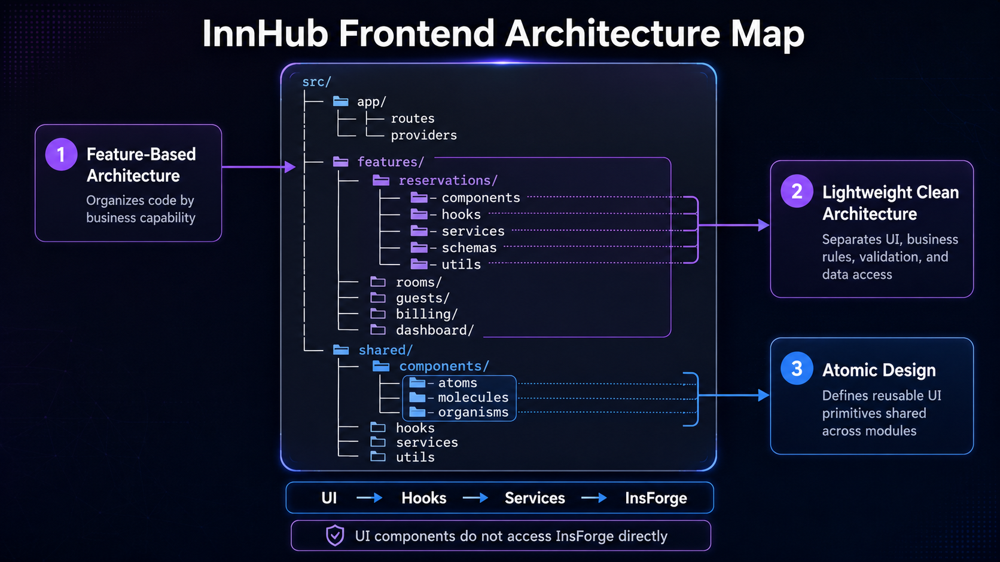

# InnHub — Internal Architecture

> This document defines the internal frontend structure and the boundaries that keep the MVP maintainable.

📄 Read this in: **English** | [Español](05-architecture.es.md)

---

## Architecture Goals

- Keep feature code close to its business context.
- Keep shared UI reusable without overengineering.
- Encapsulate InsForge access behind services/hooks.
- Keep business rules out of JSX.
- Make important rules testable with pure functions.

## Architecture Overview


## COTS Component View



InnHub is designed as a configurable COTS-style product. Business modules such as reservations, rooms, billing, reports, and dashboard features are supported by reusable technical components such as shared UI, hooks, services, validation schemas, and utility functions.

## Frontend Architecture Map



The frontend combines three architectural decisions: Feature-Based Architecture organizes business capabilities, lightweight Clean Architecture controls dependency direction inside each feature, and Atomic Design keeps shared UI primitives reusable across modules.

## Suggested Folder Structure

```text
src/
├── app/
│   ├── routes/
│   └── providers/
├── features/
│   ├── auth/
│   ├── properties/
│   ├── users/
│   ├── rooms/
│   ├── room-types/
│   ├── guests/
│   ├── reservations/
│   ├── housekeeping/
│   ├── maintenance/
│   ├── billing/
│   ├── reports/
│   └── dashboard/
├── shared/
│   ├── components/
│   ├── hooks/
│   ├── services/
│   ├── utils/
│   └── types/
└── main.tsx
```

## Layer Rules

| Rule                                     | Why                                           |
| ---------------------------------------- | --------------------------------------------- |
| Components do not call InsForge directly | Keeps UI testable and replaceable             |
| Feature services own data access         | Keeps business context local                  |
| Shared UI is generic                     | Prevents domain leakage into atoms/components |
| Business rules are pure when possible    | Enables reliable unit tests                   |
| Realtime is wrapped in hooks/services    | Avoids duplicated subscription logic          |

## Service Layer Convention

Backend-backed features must expose data access through hooks and services, not JSX components. Services should return typed `ServiceResult<T>` style values, normalize backend failures into safe local errors before UI-facing callers see them, and keep raw SDK/backend objects behind service boundaries.

## Property-Scoped Data Access

Operational services must derive the current property scope from the authenticated session, not from component props, forms, routes, URLs, or caller-provided payloads. Service reads and mutations for property-owned records should use the shared property-scope helpers before building InsForge queries.

Use `property_id` filters for property-owned operational tables and constrain the `properties` root by `id = session.propertyId`. If a payload includes a different `property_id` than the session scope, services must reject it instead of trusting UI input.

These repository helpers are the required frontend/service pattern, but they are not complete database-level isolation. Remote InsForge/PostgreSQL policies require a separate approved, versioned, and validated slice.

## Atomic Design Usage

Use Atomic Design for shared UI only: buttons, badges, inputs, cards, modals, tables, layout primitives. Feature-specific components stay inside their feature folders.

## Reuse and Refactoring Strategy

InnHub prioritizes reusable components before feature-specific UI growth. The existing architecture and component diagrams above are the reference views for this strategy; a new diagram is not required unless the implementation introduces a new architectural boundary.

For academic goals, presentation criteria, and refactoring techniques, see [Academic & Refactoring Criteria](ACADEMIC.md).

### Implemented Shared UI Primitives

The first reusable shared UI primitives are implemented under `src/shared/components` and specified in `openspec/specs/shared-ui/spec.md`. They are intentionally small, domain-neutral, and presentation-only.

| Component     | Current status | Reuse target                                                                                             | Technical justification                                                                                                |
| ------------- | -------------- | -------------------------------------------------------------------------------------------------------- | ---------------------------------------------------------------------------------------------------------------------- |
| `Button`      | Implemented    | Primary and secondary actions across reservations, check-in/check-out, billing, and settings             | Centralizes interaction states, accessibility behavior, and visual consistency for repeated user actions               |
| `StatusBadge` | Implemented    | Room states, reservation states, cleaning tasks, maintenance tickets, invoices, and payments             | Keeps status presentation consistent while preventing domain-specific styling from being duplicated in feature screens |
| `MetricCard`  | Implemented    | Dashboard indicators, occupancy reports, revenue summaries, and operational alerts                       | Provides a reusable display pattern for caller-provided metrics without calculating business values                    |
| `ModuleCard`  | Implemented    | Navigation or summaries for rooms, reservations, guests, billing, housekeeping, maintenance, and reports | Lets the product line expose different modules with a consistent reusable card pattern                                 |
| `PageSection` | Implemented    | Shared page spacing, headings, descriptions, actions, and responsive sections                            | Separates section structure from business content and avoids repeating page scaffolding in every feature               |

`PageSection` was implemented instead of a full `AppLayout` for this stage because routing, authentication, navigation, and protected layout decisions belong to later work. These primitives should remain generic: room-specific labels, reservation rules, metric calculations, and business decisions belong in feature code, schemas, services, or utility functions.

## Related Documents

- [Academic Criteria](ACADEMIC.md)
- [Tech Stack](04-tech-stack.md)
- [Domain Model](03-domain-model.md)
