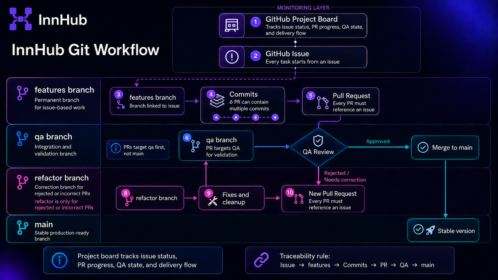

# InnHub — Git Workflow

> This document defines the branch, issue, commit, and pull request workflow for an individual academic/professional project.

📄 Read this in: **English** | [Español](06-git-workflow.es.md)

---

## Work Tracking

InnHub uses GitHub Projects to monitor issue status, PR progress, QA validation, and delivery flow. Every meaningful task starts as an issue before code or documentation changes are merged.



The workflow keeps traceability explicit: issue, `features` work, commits, pull request, QA validation, and final merge into `main`.

## Branch Strategy

Only four permanent branches are used:

| Branch     | Purpose                                                   |
| ---------- | --------------------------------------------------------- |
| `main`     | Stable, deployable, defense-ready version                 |
| `qa`       | Validation branch before production/main                  |
| `features` | Normal feature development branch                         |
| `refactor` | Structural corrections and cleanup before returning to QA |

No temporary `feature/*`, `bugfix/*`, or `docs/*` branches are required for this individual project.

## Normal Flow

```text
GitHub Project → Issue → work on features → commits → PR to qa → validation → PR to main
```

Each PR must reference its related issue. A PR can contain multiple commits as long as they belong to the same reviewable work unit.

If QA reveals structural issues:

```text
qa → refactor → fixes/cleanup → PR back to qa → PR to main
```

## Issue-first Rule

Every meaningful change should be linked to a concrete issue. Issues describe scope, acceptance criteria, and evidence needed for review.

## Commit Format

```text
type(scope): short description
```

Suggested types: `feat`, `fix`, `docs`, `refactor`, `test`, `style`, `chore`.

Examples:

```text
feat(reservations): add date overlap validation
docs(readme): add product overview section
refactor(rooms): extract availability calculation
```

## Pull Request Rules

- Link the related issue.
- Explain what changed and why.
- Include screenshots for UI changes.
- Include test/build evidence when available.
- Avoid unrelated large mixes.

## Final Defense Checklist

- Stable `main` branch.
- Updated README.
- Install/run instructions.
- Screenshots or demo assets.
- Deploy link if available.
- Documented data model, stack, architecture, and workflow.
- Representative issues and PRs.

## Related Documents

- [Architecture](05-architecture.md)
- [Tech Stack](04-tech-stack.md)
