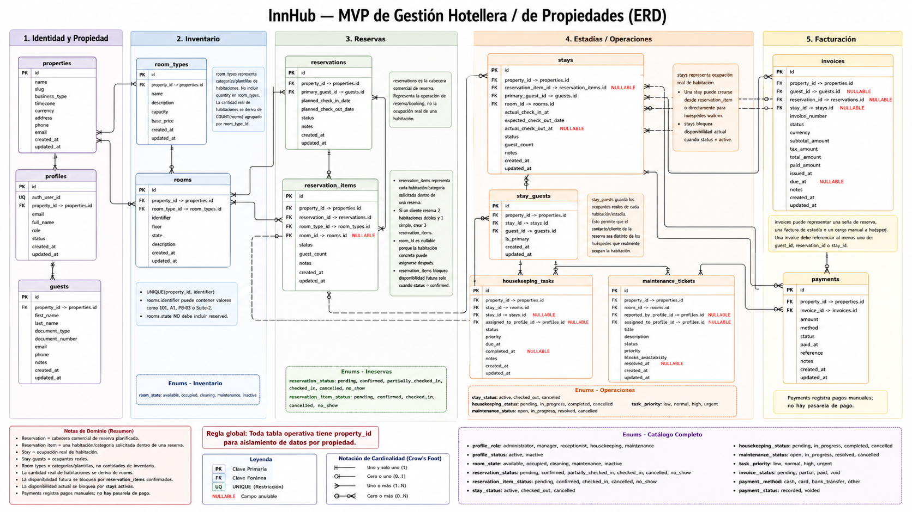

# InnHub — ERD de Base de Datos

> Este documento define el modelo entidad-relación a nivel base de datos para el MVP de InnHub.

📄 Leer en: [English](08-database-erd.md) | **Español**

---

## Resumen ejecutivo

InnHub usa un modelo PostgreSQL separado por propiedad. El ERD separa reservas planificadas de ocupación real para soportar reservas confirmadas, estadías walk-in, reservas grupales, limpieza, mantenimiento, facturación y métricas sin sobrecargar una sola tabla con demasiados significados.



## Decisión central

| Área | Decisión |
| --- | --- |
| Alcance por propiedad | Toda tabla operativa incluye `property_id`. |
| Identidad de staff | `profiles.id` es la identidad interna de InnHub; `auth_user_id` vincula con el proveedor auth externo. |
| Categorías de habitación | `room_types` guarda categorías/plantillas, no cantidades de inventario. El inventario real se deriva de `rooms`. |
| Identificador de habitación | `rooms.identifier` acepta números, letras o etiquetas mixtas como `101`, `A1` o `PB-03`. |
| Reservas | `reservations` es la cabecera comercial de reserva. |
| Ítems de reserva | `reservation_items` guarda cada habitación/categoría solicitada dentro de una reserva. |
| Estadías | `stays` guarda la ocupación real y puede existir sin reserva para walk-ins. |
| Ocupantes | `stay_guests` guarda los huéspedes reales de cada habitación. |
| Facturación | `invoices` puede relacionarse con seña de reserva, estadía o cargo manual a huésped. |
| Estados | Se prefieren enums nativos PostgreSQL para estados estables del dominio. |

## Grupos de entidades

### Identidad y propiedad

| Tabla | Propósito |
| --- | --- |
| `properties` | Configuración del alojamiento y raíz operativa. |
| `profiles` | Perfil de personal asociado a una propiedad y vinculado a auth con `auth_user_id`. |
| `guests` | Personas clientes/huéspedes usadas como contactos de reserva, ocupantes, receptores de factura o pagadores. |

### Inventario

| Tabla | Propósito |
| --- | --- |
| `room_types` | Categoría/plantilla de habitación con capacidad y precio base. |
| `rooms` | Habitación/unidad física con `identifier` flexible y estado físico. |

`room_types` no guarda `quantity`. Para saber cuántas habitaciones existen en una categoría, se cuentan las filas de `rooms` por `room_type_id`.

### Reservas y estadías

| Tabla | Propósito |
| --- | --- |
| `reservations` | Cabecera de reserva con huésped/contacto principal y rango de fechas planificado. |
| `reservation_items` | Una habitación/categoría solicitada dentro de una reserva. Varios ítems soportan reservas grupales. |
| `stays` | Ocupación real de habitación, creada desde un ítem de reserva o directamente para walk-ins. |
| `stay_guests` | Ocupantes reales asociados a una estadía. |

Un cliente puede reservar dos habitaciones dobles y una simple como una `reservation` con tres `reservation_items`. Al llegar, cada ítem puede convertirse en una `stay`, y los ocupantes reales se registran en `stay_guests`.

`reservation_items.room_id` es nullable para permitir reservas por categoría. Cuando se asigna una habitación concreta, debe pertenecer al mismo `room_type_id` del ítem.

### Operaciones

| Tabla | Propósito |
| --- | --- |
| `housekeeping_tasks` | Trabajo de limpieza, usualmente generado luego del check-out. |
| `maintenance_tickets` | Incidencias de mantenimiento que pueden bloquear disponibilidad. |

### Facturación

| Tabla | Propósito |
| --- | --- |
| `invoices` | Documento de facturación para señas, estadías o cargos manuales a huésped. |
| `payments` | Registros manuales de pago vinculados a facturas. El MVP no guarda datos de pasarela de pago. |

## Relaciones principales

```text
Property
├── Profiles
├── Guests
├── RoomTypes ─── Rooms
├── Reservations ─── ReservationItems ─── Stays ─── StayGuests
├── HousekeepingTasks
├── MaintenanceTickets
└── Invoices ─── Payments
```

Cardinalidades clave:

- Una `property` tiene muchos registros operativos.
- Un `room_type` tiene muchas `rooms` y muchos `reservation_items`.
- Una `reservation` tiene muchos `reservation_items`.
- Un `reservation_item` puede producir cero o una `stay`.
- Una `stay` tiene muchos `stay_guests`.
- Una `invoice` tiene muchos `payments`.

## Reglas de disponibilidad

| Fuente | Efecto sobre disponibilidad |
| --- | --- |
| `reservation_items.status = confirmed` | Bloquea disponibilidad futura para el rango planificado. |
| `stays.status = active` | Bloquea disponibilidad actual de la habitación. |
| `rooms.state = maintenance` o `inactive` | La habitación no se puede asignar. |
| `maintenance_tickets.blocks_availability = true` | La habitación no se puede asignar mientras el ticket no esté resuelto. |

Reglas importantes:

- `rooms.state` no debe incluir `reserved`.
- Un ítem de reserva `pending` no garantiza inventario.
- Las estadías consecutivas están permitidas: la fecha de check-out no ocupa la noche siguiente.

## Enums propuestos

| Enum | Valores |
| --- | --- |
| `profile_role` | `administrator`, `manager`, `receptionist`, `housekeeping`, `maintenance` |
| `profile_status` | `active`, `inactive` |
| `room_state` | `available`, `occupied`, `cleaning`, `maintenance`, `inactive` |
| `reservation_status` | `pending`, `confirmed`, `partially_checked_in`, `checked_in`, `cancelled`, `no_show` |
| `reservation_item_status` | `pending`, `confirmed`, `checked_in`, `cancelled`, `no_show` |
| `stay_status` | `active`, `checked_out`, `cancelled` |
| `housekeeping_status` | `pending`, `in_progress`, `completed`, `cancelled` |
| `maintenance_status` | `open`, `in_progress`, `resolved`, `cancelled` |
| `task_priority` | `low`, `normal`, `high`, `urgent` |
| `invoice_status` | `pending`, `partial`, `paid`, `void` |
| `payment_method` | `cash`, `card`, `bank_transfer`, `other` |
| `payment_status` | `recorded`, `voided` |

## Notas de implementación

- Usar claves primarias UUID salvo que InsForge imponga otra convención.
- Agregar `created_at` y `updated_at` en tablas mutables.
- Agregar `UNIQUE(property_id, identifier)` en `rooms`.
- Evitar referencias cruzadas entre propiedades, no depender solo de filtros en queries.
- Mantener reportes derivados desde tablas base al inicio; evitar tablas persistidas de reportes en el MVP.
- Implementar la prevención compleja de solapamientos en un slice posterior de disponibilidad, pero diseñar #6 con los campos y estados necesarios.

## Fuera de alcance para este ERD

- Pantallas de auth y sesión.
- Datos seed/demo.
- Service layer frontend y hooks.
- Trigger o constraint concreto para solapamiento de reservas.
- Mutaciones automáticas de check-in/check-out.
- Integraciones con pasarelas de pago.
- Tablas persistidas de analítica/reportes.

## Documentos relacionados

- [Modelo de dominio](03-domain-model.es.md)
- [Alcance MVP](02-mvp-scope.es.md)
- [Especificación funcional](07-functional-specification.es.md)
- [Stack tecnológico](04-tech-stack.es.md)
