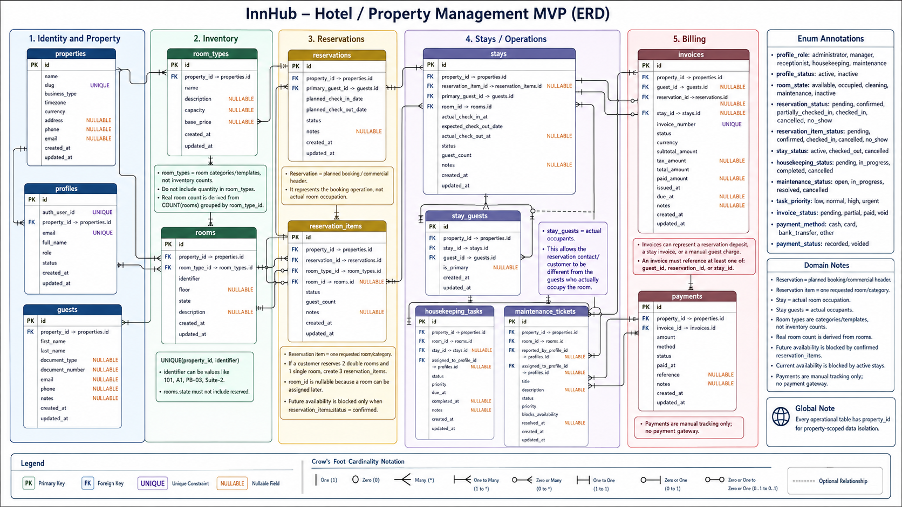

# InnHub — Database ERD

> This document defines the MVP database-level entity relationship model for InnHub.

📄 Read this in: **English** | [Español](08-database-erd.es.md)

---

## Executive Summary

InnHub uses a property-scoped PostgreSQL model. The ERD separates planned bookings from actual room occupation so the system can support confirmed reservations, walk-in stays, grouped reservations, housekeeping, maintenance, billing, and dashboard metrics without overloading one table with multiple meanings.



## Core Decision

| Area | Decision |
| --- | --- |
| Property scope | Every operational table includes `property_id`. |
| Staff identity | `profiles.id` is InnHub's internal user identity; `auth_user_id` links to the external auth provider. |
| Room categories | `room_types` stores categories/templates, not inventory counts. Real inventory is derived from `rooms`. |
| Room identifier | `rooms.identifier` accepts numbers, letters, or mixed labels such as `101`, `A1`, or `PB-03`. |
| Reservations | `reservations` is the commercial booking header. |
| Reservation items | `reservation_items` stores each requested room/category inside a reservation. |
| Stays | `stays` stores actual room occupation and can exist without a reservation for walk-ins. |
| Occupants | `stay_guests` stores the real guests occupying each room. |
| Billing | `invoices` can relate to a reservation deposit, a stay, or a manual guest charge. |
| States | PostgreSQL enums are preferred for stable domain states. |

## Entity Groups

### Identity and property

| Table | Purpose |
| --- | --- |
| `properties` | Accommodation business configuration and operational root. |
| `profiles` | Staff profile scoped to one property and linked to auth through `auth_user_id`. |
| `guests` | Guest/customer person records used as reservation contacts, occupants, invoice recipients, or payers. |

### Inventory

| Table | Purpose |
| --- | --- |
| `room_types` | Room category/template with capacity and base price. |
| `rooms` | Physical room/unit with a flexible `identifier` and physical state. |

`room_types` does not store `quantity`. To know how many rooms exist for a category, count `rooms` by `room_type_id`.

### Reservations and stays

| Table | Purpose |
| --- | --- |
| `reservations` | Booking header with the contact guest and planned date range. |
| `reservation_items` | One requested room/category within a reservation. Multiple items support grouped reservations. |
| `stays` | Actual room occupation, created from a reservation item or directly for walk-ins. |
| `stay_guests` | Actual occupants associated with a stay. |

A customer can reserve two double rooms and one single room as one `reservation` with three `reservation_items`. On arrival, each item can become one `stay`, and the actual occupants are recorded in `stay_guests`.

`reservation_items.room_id` is nullable to support category-level reservations. When a concrete room is assigned, it must belong to the same `room_type_id` as the item.

### Operations

| Table | Purpose |
| --- | --- |
| `housekeeping_tasks` | Cleaning work, commonly generated after check-out. |
| `maintenance_tickets` | Room maintenance issues that may block availability. |

### Billing

| Table | Purpose |
| --- | --- |
| `invoices` | Billing document for deposits, stays, or manual guest charges. |
| `payments` | Manual payment records linked to invoices. No payment gateway data is stored in the MVP. |

## Main Relationships

```text
Property
├── Profiles
├── Guests
├── RoomTypes ─── Rooms
├── Reservations ─── ReservationItems ─── Stays ─── StayGuests
├── HousekeepingTasks
├── MaintenanceTickets
└── Invoices ─── Payments
```

Key cardinalities:

- One `property` has many operational records.
- One `room_type` has many `rooms` and many `reservation_items`.
- One `reservation` has many `reservation_items`.
- One `reservation_item` can produce zero or one `stay`.
- One `stay` has many `stay_guests`.
- One `invoice` has many `payments`.

## Availability Rules

| Source | Availability effect |
| --- | --- |
| `reservation_items.status = confirmed` | Blocks future availability for the planned date range. |
| `stays.status = active` | Blocks current room availability. |
| `rooms.state = maintenance` or `inactive` | Room is not assignable. |
| `maintenance_tickets.blocks_availability = true` | Room is not assignable while the ticket is unresolved. |

Important rules:

- `rooms.state` must not include `reserved`.
- A `pending` reservation item does not guarantee inventory.
- Back-to-back stays are allowed: the check-out date is not occupied for the next night.

## Proposed Enums

| Enum | Values |
| --- | --- |
| `profile_role` | `administrator`, `manager`, `receptionist`, `housekeeping`, `maintenance` |
| `profile_status` | `active`, `inactive` |
| `room_state` | `available`, `occupied`, `cleaning`, `maintenance`, `inactive` |
| `reservation_status` | `pending`, `confirmed`, `partially_checked_in`, `checked_in`, `cancelled`, `no_show` |
| `reservation_item_status` | `pending`, `confirmed`, `checked_in`, `cancelled`, `no_show` |
| `stay_status` | `active`, `checked_out`, `cancelled` |
| `housekeeping_status` | `pending`, `in_progress`, `completed`, `cancelled` |
| `maintenance_status` | `open`, `in_progress`, `resolved`, `cancelled` |
| `task_priority` | `low`, `normal`, `high`, `urgent` |
| `invoice_status` | `pending`, `partial`, `paid`, `void` |
| `payment_method` | `cash`, `card`, `bank_transfer`, `other` |
| `payment_status` | `recorded`, `voided` |

## Implementation Notes

- Use UUID primary keys unless InsForge imposes a different convention.
- Add `created_at` and `updated_at` to mutable tables.
- Add `UNIQUE(property_id, identifier)` to `rooms`.
- Prevent cross-property references between related rows, not only by query filters.
- Keep reports derived from base tables first; avoid persisted report tables in the MVP.
- Enforce complex overlap prevention in a later availability slice, but design #6 so the required fields and states exist.

## Out of Scope for This ERD

- Auth screens and session UI.
- Seed/demo data.
- Frontend service layer and hooks.
- Concrete reservation overlap trigger or exclusion constraint.
- Automatic check-in/check-out workflow mutations.
- Payment gateway integrations.
- Persisted analytics/reporting tables.

## Related Documents

- [Domain Model](03-domain-model.md)
- [MVP Scope](02-mvp-scope.md)
- [Functional Specification](07-functional-specification.md)
- [Tech Stack](04-tech-stack.md)
