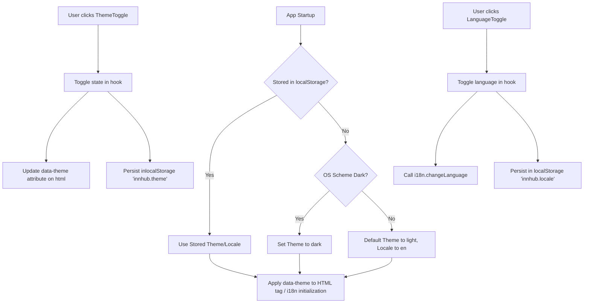

# Design: Expose Theme and Language Controls

## Technical Approach

We will implement a clean, decoupled **Hook + Atom Composition** architecture:
1. **State Hooks (`src/shared/hooks/`)**: `useTheme` manages HTML DOM `data-theme` updates, localStorage persistence (`innhub.theme`), and OS scheme queries. `useLocale` serves as a clean hook adapter around the existing i18next instance and `innhub.locale` storage utilities.
2. **Accessible Atoms (`src/shared/components/atoms/`)**: `ThemeToggle` and `LanguageToggle` represent dedicated button atoms built upon the existing generic `Button` atom.
3. **Composed Molecule (`src/shared/components/molecules/`)**: `PreferenceBar` aggregates both toggles into a single, styling-neutral container.
4. **Layout Integration**: The `PreferenceBar` will be integrated into authenticated layout headers (`TopBar`) and positioned absolute/fixed on public routes (`LoginPage`, `PublicHomePage`).

## Architecture Decisions

### Decision: Root HTML Attribute vs Context Provider for Theme
**Choice**: Apply theme directly to the root element (`<html data-theme="...">`) via `document.documentElement.setAttribute("data-theme", theme)`.
**Alternatives**: Wrap the app in a custom `ThemeProvider` context.
**Rationale**: Tailwind CSS v4 in `src/index.css` is configured with a custom variant mapping `data-theme="dark"`. Using a root HTML attribute is highly performant, avoids unnecessary React Context re-renders, and is incredibly simple. It also makes it trivial to prevent Flash of Unstyled Content (FOUC) in the future using a lightweight inline `<script>` in `index.html`.

### Decision: Adapter Hooks for External State APIs
**Choice**: Encapsulate i18next and theme side-effects in custom hooks (`useLocale` and `useTheme`) inside `src/shared/hooks/`.
**Alternatives**: Access `i18n.changeLanguage()` directly in UI components.
**Rationale**: Wrapping third-party library calls and localStorage side-effects inside pure hooks ensures that component templates remain fully declarative and highly testable, decoupling them from external implementations.

## Data Flow



## File Changes

| File | Action | Description |
|------|--------|-------------|
| `src/shared/hooks/useTheme.ts` | New | Theme management hook (resolves storage → prefers-color-scheme → "light") |
| `src/shared/hooks/useLocale.ts` | New | i18next locale-switching hook adapter |
| `src/shared/hooks/index.ts` | New | Barrel exports for shared hooks |
| `src/shared/components/atoms/ThemeToggle.tsx` | New | Dark/light button atom with SVGs and accessible names |
| `src/shared/components/atoms/LanguageToggle.tsx` | New | Language switcher button atom with text and accessible names |
| `src/shared/components/atoms/index.ts` | Modify | Add `ThemeToggle` and `LanguageToggle` to exports |
| `src/shared/components/molecules/PreferenceBar.tsx` | New | Container molecule composing both toggles |
| `src/shared/components/molecules/index.ts` | Modify | Add `PreferenceBar` to exports |
| `src/app/shell/TopBar.tsx` | Modify | Mount `PreferenceBar` in the rightmost flex area |
| `src/app/pages/LoginPage.tsx` | Modify | Mount `PreferenceBar` absolutely positioned in top-right |
| `src/app/pages/PublicHomePage.tsx` | Modify | Mount `PreferenceBar` absolutely positioned in top-right |
| `src/shared/i18n/resources/en.ts` | Modify | Add aria-label and UI strings in English |
| `src/shared/i18n/resources/es.ts` | Modify | Add aria-label and UI strings in Spanish |

## Interfaces / Contracts

```typescript
// src/shared/hooks/useTheme.ts
export type Theme = "light" | "dark";
export interface UseThemeResult {
  theme: Theme;
  toggleTheme: () => void;
}
export function useTheme(): UseThemeResult;

// src/shared/hooks/useLocale.ts
import type { Locale } from "../i18n/locales";
export interface UseLocaleResult {
  locale: Locale;
  toggleLocale: () => void;
}
export function useLocale(): UseLocaleResult;
```

## Testing Strategy

| Layer | What to Test | Approach |
|-------|--------------|----------|
| Unit (Hooks) | `useTheme` resolution and persistence | Mock `localStorage` & `window.matchMedia`. Assert `data-theme` changes on DOM. |
| Unit (Hooks) | `useLocale` wrapped transition | Mock `i18next` change functions. Assert correct locales are requested and stored. |
| Unit (UI Components) | `ThemeToggle` & `LanguageToggle` | Render with Vitest/RTL. Assert correct translation-backed `aria-label` values are applied. |
| Integration | `PreferenceBar` on key pages | Assert toggles are rendered on Login, Public Home, and TopBar. Verify they click and trigger states. |

## Migration / Rollout

No database or API updates are needed. The rollout is purely frontend additions.
Rollback is performed by reverting the single commit and restoring barrel exports.

## Open Questions

None.
