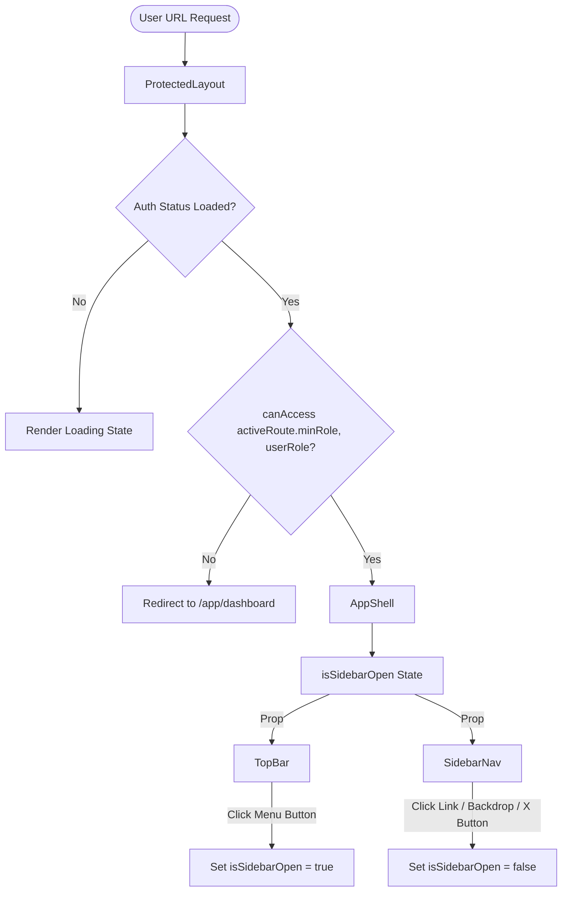

# Design: feat-settings-organization

## Technical Approach

Implement responsive navigation components and a strict role-based route guard to enhance InnHub's layout and access control. Using React state inside `AppShell`, we will build an off-canvas drawer that opens via a hamburger menu in `TopBar`, closes automatically on backdrop click or sidebar navigation, and leverages standard Tailwind transition classes. The drawer toggle and close buttons reuse the generic `Button` component inside `src/shared/components/atoms/Button.tsx` (using variant `"ghost"`). Role validation is integrated inside `ProtectedLayout.tsx` to restrict unauthorized direct URL access. Lastly, `ReadOnlyField` fields in `PropertyProfilePage.tsx` are refactored to use a responsive grid configuration.

## Architecture Decisions

| Decision | Option | Tradeoff | Decision / Rationale |
| :--- | :--- | :--- | :--- |
| **Mobile Drawer State** | Stateful Props in `AppShell` | Requires simple prop-drilling to direct descendants (`TopBar`, `SidebarNav`). | **Stateful Props in `AppShell`**. Keeps the layout logic simple, clean, and highly localized without context boilerplate or custom hooks, which is ideal for this MVP context. |
| **Mobile Drawer State (Rejected)** | React Layout Context | Overkills a flat static layout; increases complexity and code footprint. | **Rejected** in favor of stateful props. |
| **UI Atom Reuse** | Wrap Lucide Icons in shared `Button` atom | Reuses existing atomic UI framework; matches standard Tailwind transition and styles. | **Wrap Lucide in shared `Button` atom**. Promotes atomic design consistency and encapsulates click states, hover effects, and theme styles. |
| **Access Control Guard** | Redirect in `ProtectedLayout` | Redirects to `/app/dashboard` (the most permissive safe route) via standard `<Navigate to="/app/dashboard" replace />`. | **Redirect in `ProtectedLayout`**. Simple, highly secure, prevents rendering unauthorized pages, and requires no translation key additions. |

## Data Flow

The flow below represents how state and user roles govern component rendering, screen transitions, and navigation:



## File Changes

| File | Action | Description |
|------|--------|-------------|
| `src/app/shell/AppShell.tsx` | Modify | Keep state `isSidebarOpen`, render backdrop overlay, off-canvas transitions for `<aside>`, and close button in sidebar header. |
| `src/app/shell/TopBar.tsx` | Modify | Add `onToggleSidebar` prop and a hamburger toggle button (Button atom + Lucide Menu icon) for small screens. |
| `src/app/shell/SidebarNav.tsx` | Modify | Add `onClose` prop and invoke it inside NavLink click handlers. |
| `src/app/layouts/ProtectedLayout.tsx` | Modify | Enforce check `!canAccess(activeRoute.minRole, userRole)` if `activeRoute` exists; redirect to `/app/dashboard` replace on failure. |
| `src/features/properties/PropertyProfilePage.tsx` | Modify | Change styling of `ReadOnlyField` component to `grid grid-cols-1 sm:grid-cols-[180px_1fr] gap-1 sm:gap-2 text-sm`. |

## Interfaces / Contracts

No new interfaces are created, but existing component props are updated as follows:

```typescript
// src/app/shell/AppShell.tsx
type AppShellProps = {
	activeRoute?: ProtectedRouteMeta;
	children: ReactNode;
	items: readonly GroupedRouteItem[];
};

// src/app/shell/TopBar.tsx
type TopBarProps = {
	activeRoute?: ProtectedRouteMeta;
	onToggleSidebar: () => void;
};

// src/app/shell/SidebarNav.tsx
type SidebarNavProps = {
	items: readonly GroupedRouteItem[];
	onClose?: () => void;
};
```

## Testing Strategy

| Layer | What to Test | Approach |
|-------|-------------|----------|
| Unit / Integration | Shell Responsiveness & Drawer Toggling | Render `AppShell` with viewport dimensions, trigger toggle button, assert that drawer transitions, backdrop renders, and navigation links call the close handler. |
| Unit / Integration | Role Router Guard | Mount `ProtectedLayout` wrapped in `AuthContext` with a receptionist role; attempt direct navigation to `/app/settings/property` and verify redirection. |
| Unit / Integration | Screen Responsiveness | Mount `PropertyProfilePage` in read-only mode and assert structural class `sm:grid-cols-[180px_1fr]` is applied to `ReadOnlyField`. |

## Migration / Rollout

No database or schema migrations are required for this change. The changes are fully local to the frontend layouts and UI.

## Open Questions

None.
